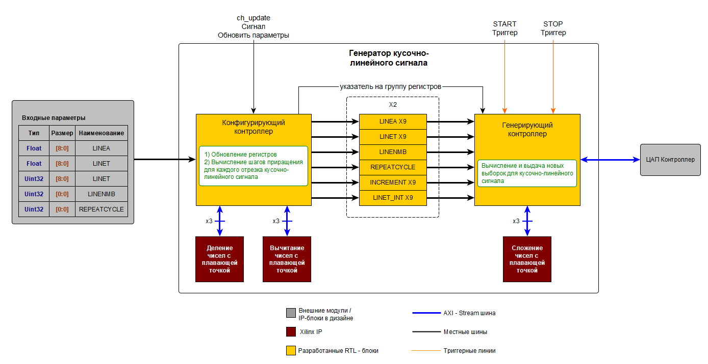
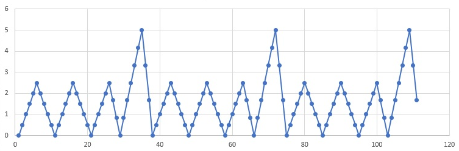
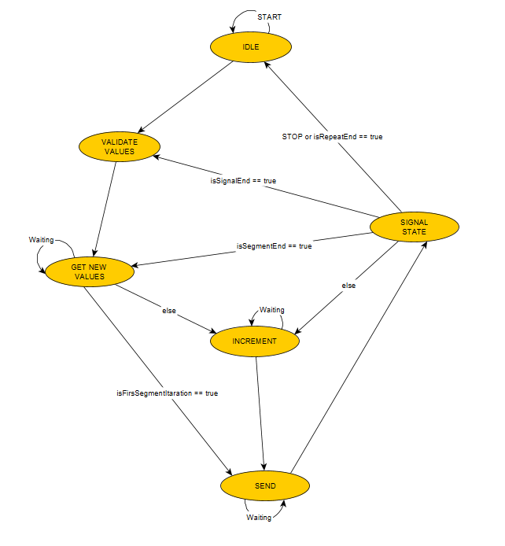
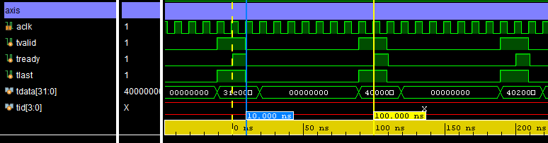
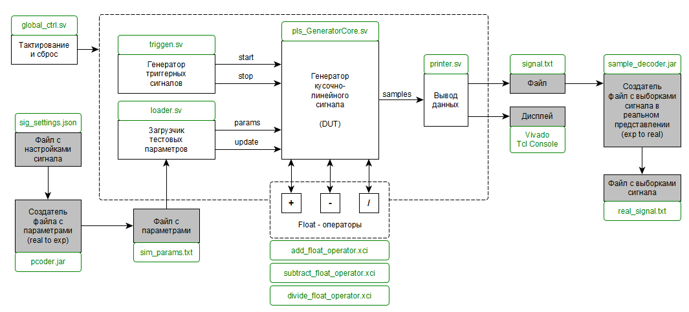

Генератор кусочно-линейного сигнала
===================

## Описание
Генератор кусочно-линейного сигнала представляет собой функциональный блок, реализующий выдачу выборок кусочно-линейного сигнала.  

Данный функциональный блок реализован на **System Verilog HDL** и предназначен для использования в дизайне цифровой микроархетиктуры, реализуемой на базе микросхем FPGA.   
      
***Структура функционального блока***     
 

  
  
 ***Пример кусочно-линейного сигнала***   

   

**Форма кусочно-линейного сигнала настраивается по следующим параметрам:**   
1. LINENMB - количество интервалов в сигнале. Максимум 9, минимум 1;  
2. LINEA[9] - значения начальных точек в интервалах сигнала;
3. LINET[9] - длительность интервала (количество отрезков между начальной и конечной точками интервала);  
4. REPEATCYCLE - количество циклов выдачи сигнала.   
  
**Функциональный блок имеет следующие порты:**  
1. 26 32-разрядных портов для установления значений параметров сигнала;   
2. 1-разрядный порт ch_update - сигнал-импульс для валидации входных параметров функциональным блоком;   
3. 1-разрядный порт Start trigger - сигнал-импульс для запуска генерации сигнала;  
4. 1-разрядный порт Stop trigger - сигнал-импульс для остановки генерации сигнала;  
5. 4 AXI-Stream Master порта. 1 порт для выдачи выборок сигнала, 3 порта для подключения к 3-м блок Float ALU.    
    
Генерация выдачи сигнала управляется сигналом TREADY AXI-Stream интерфейса.   

**В состав функционального блока входят:**  
1. Конфигурирующий контроллер;  
2. 2 группы регистров;  
3. Генерирующий контроллер.  
  
**Конфигурирующий контроллер по сигналу ch_update осуществляет:** 
1. чтение входных параметров;
2. вычисление шага приращения для каждого интервала в сигнале;
3. запись всех необходимых значений в группу регистров, с которой на данный момент генерирующий контроллер не работает;
4. установку флага-указателя на обновленную группу регистров, с которой генерирующий контроллер начнет работать по завершению цикла выдачи сигнала.  
  
**Группа регистров состоит из следующих полей:**  
1. LINEA[9] - float значения начальных точек в интервалах сигнала в битовом представлении;  
2. LINET[9] - float значения длительности интервалов сигнала в битовом представлении;  
3. LINET_INT[9] - uint значения длительности интервалов сигнала;  
4. INCREMENT[9] - float значения приращения для каждого интервала в сигнале в битовом представлении;  
5. LINENMB - uint значение количества интервалов в сигнале;  
6. REPEATCYCLE - uint значения количества циклов выдачи сигнала.  
  
**Генерирующий контроллер по сигналу START осуществляет**  
1. чтение параметров в группе регистров, на которую выставлен указатель;  
2. последовательное вычисление всех точек сигнала;  
3. выдачу значений всех точек сигнала по AXI-Stream.  

***Логика работы конечного автомата для генерирующего контроллера***  

  
         
***Пример выдачи сигнала по AXI-Stream интерфейсу***  

   
  
## Использование
   
Для использования данного функционального блока необходимо:  
1. Включить все файлы из папки src в проект дизайна для FPGA;  
2. Подсоединить к шинам AXIS данного функционального блока три Float-point ALU блока;    
  
В качестве Float ALU могут использоваться блоки ALU из данного репозитория (в папке sim), либо экземпляры IP-ядра Float-point (в режиме Non-blocking), доступного бесплатно в среде Vivado.  
  
## Работа с тестовым окружением   

**Структура тестового окружения**  
 

   
  
**Порядок работы**  
1. В папке sim\pcoder в файле sig_settings.json записать в формате json параметры сигнала;    
2. Запустить программу pcoder.jar (смотри как в readme.txt в папке pcoder);   
3. Запустить симуляцию в SDK (Vivado);   
4. По завершении симуляции в папке sim\sample_decoder запустить программу sample_decoder.jar (смотри как в readme.txt в папке sample_decoder);   
5. Скопировать данные сигнала в файле real_signal.txt, вставить в Exel и построить график.   
  
Расположение файлов в каталоге sim не следуюет нарушать.    

## Статус проекта   

В стадии поиска ошибок. Возможны обновления.